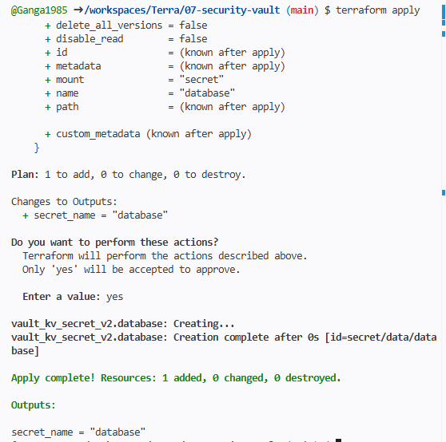
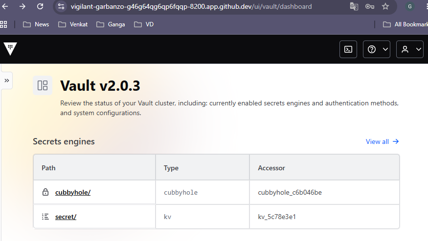
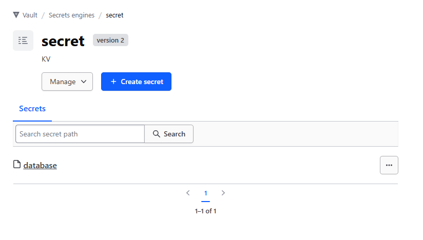

# Security & Vault

## Project Goal

Learn how to securely manage secrets using HashiCorp Vault and Terraform.

## Features

* Vault provider configuration
* Secret creation using Terraform
* Secure secret storage
* Secret verification in Vault UI

## Skills Demonstrated

* HashiCorp Vault
* Secret Management
* Terraform Providers
* Infrastructure as Code (IaC)
* Security Best Practices

## Screenshots

### Terraform apply successfully creating the Vault secret

### Vault dashboard after login

### Secret stored in Vault under secret/database

